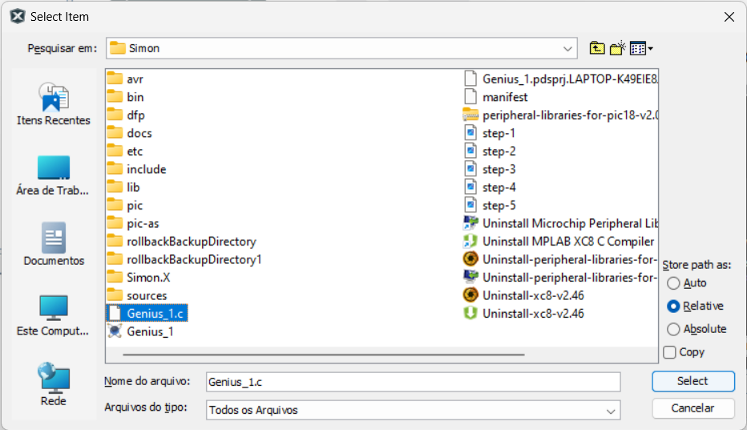

# Simon-Game-Project---PIC18F4520---Milford-4x20-BKP

This is the Simon Game project programmed in **C** language. The software was compiled using the **XC8 compiler** in the
**MPLAB X (v.5.50)** platform. The hardware of this project was created and tested on the **Proteus (v.8.13)** platform.
It was used a **PIC microcontroller (PIC18F4520)** and a **Milford-4x20-BKP**.  

## Pre-installation  

Before the installation process starts make sure you have:  

- Downloaded and installed [MPLAB X][link1] (v.5.50 or superior);
- Downloaded and installed **Proteus** (v.8.13 or superior, though for compatibility reasons version 8.13 is
recommended).

Preparing for the installation the following step should also be followed:  

1. Create a directory anywhere in your computer (make sure you know the path for this directory);  
2. Download one of the version of the C code within this repository and store it within the directory you just created
in item 1.  
   1. Code [English][link2] version.  
   2. Código versão em [Português][link3].  
3. Download the [Proteus][link4] file and store it within the same directory as item 1;  
4. Download the peripheral library within Microchip's [website][link5]. For this project the library used was
[*PIC18F Legacy Peripheral Libraries v2.0 Windows version*][link6]. (You can also find the same library for other
platforms in Microchip's website [here][link5], just scroll down to Peripheral Libraries and download the version for
your OS);  
5. Download [XC8 Compiler][link7] for your platform.

## Installation  

**The installation process should be followed to guarantee a successful compilation of the code.**  

After finishing the pre-installation requisites, the installation process will start by:

- Install the XC8 compiler with default settings. Follow the installation wizard without changing any options;
- Install the XC8 compiler one more time. This time you will point the compiler's installation path to the path of the
directory you created in item 1 of the [Pre-installation][link8] process.  
- Install the peripheral library in the same directory you created on the [Pre-installation][link8] process, item 1.

The compiler is installed twice because the installation of the *peripheral library* needs to recognize the *compiler*'s
directory.  

Both the *compiler* and the *peripheral library* need to be installed in the same directory, which is the
directory you created in item 1. However, for the MPLAB software detect the compiler, it needs to be installed in its
default path, which is within the windows' file system.  

Completed the installation process, it's time to tweak a few details before the compilation.  

## Setting up and Compiling  

To set up the lab for compiling the code, the first operations will be done within the MPLAB X environment, therefore,
within MPLAB X software proceed by doing the following steps:  

  

Create a new project. In the upper left side select:

> File > New Project...

Or you can use the shortcut `Ctrl+Shift+N`. This will prompt the previously seen window.  

Don't make any modifications in this part and just click `Next>`  

  

In this window make sure you make the following modifications:  

- Family: Advanced 8-bit MCUs (PIC 18);
- Device: PIC18F4520;
- Tool: No tool.

Proceed by clicking `Next>`  

  

Select the compiler you've just installed.  

If an option doesn't appear to be selected, that's probably because you need to install the compiler on its default path
and setting so MPLAB X can recognize it.  

  

After selecting a compiler, it's time to choose the name for the project.  

In this section, the `Project Name` can be whatever you like. However, make sure the `Project Location` and
`Project Folder` are pointing to the same directory you created on the item 1 of the [Pre-installation][link8] section.  

Complete the project's creation by clicking on `Finish`  

In order to compile the code, some modifications and addition should be done to the created project. The steps are the
following:  

  

Use the right click on the `Source Files` and select `Add Existing Item...`  

  

The selection window will pop up, choose the ".c" file you previously on item 2 and click `Select`.   

Now that a file was added to the project, it's time to make some modifications on the project's configurations.  

  

On the top left, follow the path:  

> File > Project Properties (*project's name*)  

It will pop up the configuration window. In the left hand options, click on the `XC8 Compiler` option under the
`XC8 Global Options`.  

In this window, click on the `...` of the `Include directories` option, this will open a new window.  

  

The directory window serves to include the paths for the *peripheral libraries*.  

Three directories will be added to the project which contain essential files used in the code.  

  

Click on `Browse...` and select each path for those directories and select `OK`.

Those directories are included in the *peripheral libraries*, previously installed, and should be contained within the
same directory of the project, which is supposed to be the same directory where the peripheral libraries were installed.  

  

Now, select the `XC8 Linker` option under the `XC8 Global Options`  

  

The modification will be done in the `Link in C Library` option. By default, MPLAB X uses the **C99** option. Change
this option on the dropdown menu to the **C90**, if this option is not altered, the compilation of the code will
generate errors.  

After making all those modifications, click `Apply` and `OK`. This should take you back to the main window where you can
see the code.  

  

To compile the code select the option `Clean and Build Main Project` represented by the hammer and brush option.
Otherwise, it is possible to use the shortcut `Shift+F11`.  

  

The code should compile without any errors.  

The final step for running the project is to add the generated ".hex" file to the virtual microchip into the Proteus
software.  

## Running the code  

Now, onto the Proteus software, follow the steps:  

  

Open the Proteus' file downloaded and store in the same directory as the project file, item 3 of the
[Pre-installation][link8] process.  

Click on `Open Project` option, this will pop up a selection window.  

  

Find the file downloaded on item 3, select it and click on `Open`.  

This process will open the circuit schematic of the project.  

  

Double-click on the PIC18F4520 chip, it should pop up a menu.  

  

Within the menu window, click on the folder icon of the `Program File` option.  

This will open a selection window. The hex file is located in the following path:  

> (*project's file*) > dist > default > production > (*file project name*).production.hex  

  

  

  

  

  

After finding the ".hex" file, click `Open` and this will load the hex file into the chip.  

  

When the ".hex" file is select, click `OK` and it should go back to the components schematic.  

  

After the menu is closed, the ".hex" file is loaded into the chip and everything is ready to start. Click on the play
button on the left bottom side of the screen and the game should start without any problems.  

If you followed all the steps but still faced problems during the compilation or while running the project on Proteus,
you can get in contact with me via [LinkedIn][link9] or [Email][link10].
If you want to add a new version of the C code or add a new feature to the project, feel free to reach out through the
previously mentioned means.  

### Have fun and see you soon!!! 👋😁  

[link1]: https://www.microchip.com/en-us/tools-resources/develop/mplab-x-ide
[link2]: https://github.com/ItaloHugoMDS/Simon-Game-Project---PIC18F4520---Milford-4x20-BKP/blob/main/Simon_EN.c
[link3]: https://github.com/ItaloHugoMDS/Simon-Game-Project---PIC18F4520---Milford-4x20-BKP/blob/main/Simon_PT-BR.c
[link4]: https://github.com/ItaloHugoMDS/Simon-Game-Project---PIC18F4520---Milford-4x20-BKP/blob/main/Simon.pdsprj
[link5]: https://www.microchip.com/en-us/tools-resources/archives/mplab-ecosystem#MCC2
[link6]: https://ww1.microchip.com/downloads/Secure/en/DeviceDoc/peripheral-libraries-for-pic18-v2.00rc3-windows-installer.exe
[link7]: https://www.microchip.com/en-us/tools-resources/develop/mplab-xc-compilers/xc8
[link8]: https://github.com/ItaloHugoMDS/Simon-Game-Project---PIC18F4520---Milford-4x20-BKP?tab=readme-ov-file#pre-installation
[link9]: www.linkedin.com/in/italohugomds
[link10]: silvaitalohugom@gmail.com
